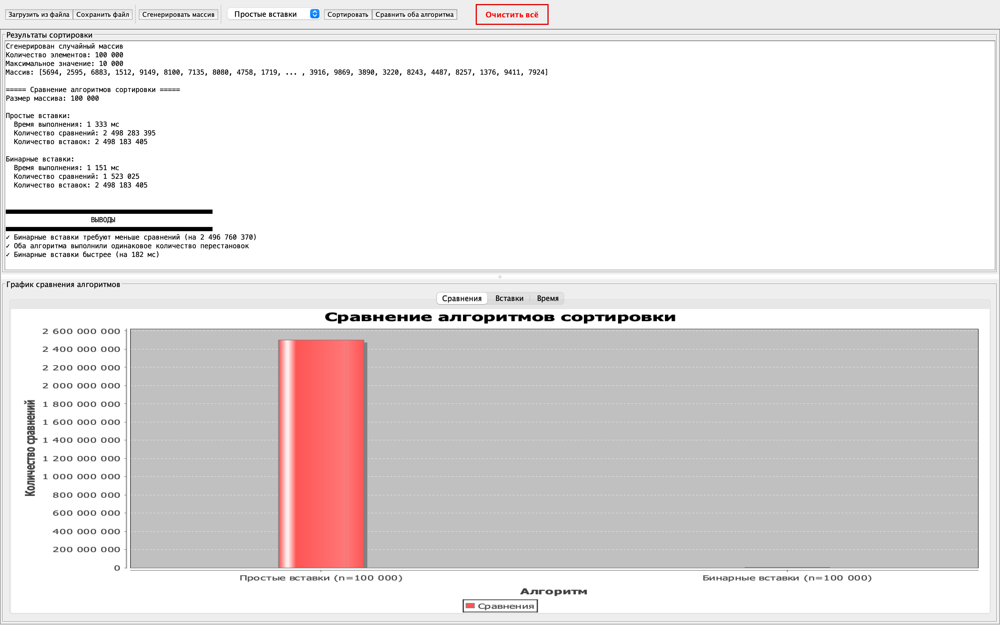

# Визуализатор алгоритмов сортировки вставками

Приложение для визуального сравнения эффективности алгоритмов сортировки простыми и бинарными вставками.



## Функциональность

- Визуальное сравнение алгоритмов сортировки вставками
- Измерение количества сравнений и перестановок для каждого алгоритма
- Графическое представление результатов с помощью JFreeChart
- Генерация случайных массивов различного размера
- Загрузка и сохранение массивов и результатов в файлы

## Системные требования

- Java 17 или выше (подойдут JDK 17, 18, 19, 20, 21+)
- Maven 3.6.0 или выше

## Быстрый старт

### Windows

1. **Установка Java и Maven**:
   - Скачайте и установите [Java JDK 17](https://www.oracle.com/java/technologies/downloads/) или более новую версию
   - Скачайте [Maven](https://maven.apache.org/download.cgi) и распакуйте в любую директорию
   - Добавьте путь к Maven в переменную окружения PATH

2. **Сборка и запуск**:
   ```batch
   git clone https://github.com/svgerasimov/sort-visualizer.git
   cd sort-visualizer
   mvn clean compile exec:java -Dexec.mainClass="org.example.SortVisualizerApp"
   ```

### macOS

1. **Установка Java и Maven**:
   ```bash
   # Установка с помощью Homebrew
   brew install openjdk@17
   brew install maven
   ```

2. **Сборка и запуск**:
   ```bash
   git clone https://github.com/svgerasimov/sort-visualizer.git
   cd sort-visualizer
   mvn clean compile exec:java -Dexec.mainClass="org.example.SortVisualizerApp"
   ```

## Пошаговое руководство

### 1. Генерация или загрузка массива

- **Сгенерировать массив**: Нажмите кнопку "Сгенерировать массив" и введите размер массива и максимальное значение элементов.
- **Загрузить из файла**: Нажмите кнопку "Загрузить из файла" и выберите текстовый файл с числами, разделенными пробелами.

### 2. Сортировка массива

- Выберите тип сортировки из выпадающего списка: "Простые вставки" или "Бинарные вставки"
- Нажмите кнопку "Сортировать"
- Результаты сортировки отобразятся в текстовой области

### 3. Сравнение алгоритмов

- Нажмите кнопку "Сравнить оба алгоритма" для запуска обоих алгоритмов на одном массиве
- Результаты сравнения будут отображены в текстовой области и на графиках

### 4. Анализ результатов

- Переключайтесь между вкладками "Сравнения", "Вставки" и "Время" для просмотра различных аспектов сравнения
- В разделе "ВЫВОДЫ" представлены основные заключения о производительности алгоритмов

### 5. Сохранение результатов

- Нажмите кнопку "Сохранить файл" для сохранения результатов в файл CSV

## Генерация тестовых файлов

Для генерации тестовых файлов с массивами используйте класс `ArrayFileGenerator`:

```bash
# Windows / macOS
mvn clean compile exec:java -Dexec.mainClass="org.example.ArrayFileGenerator"
```

Сгенерированные файлы сохраняются в текущую рабочую директорию:

- **Windows**: Обычно в папке проекта или где запущена команда
- **macOS**: В директории, откуда запущена команда

Если вы хотите изменить директорию сохранения, измените путь в методе `main` класса `ArrayFileGenerator`.

## Описание алгоритмов сортировки

### Сортировка простыми вставками

Алгоритм последовательно перебирает массив и для каждого элемента находит правильную позицию в уже отсортированной части массива. Для поиска позиции используется линейный поиск.

**Сложность**:
- Временная сложность: O(n²)
- Пространственная сложность: O(1)

### Сортировка бинарными вставками

Оптимизированная версия сортировки вставками, использующая бинарный поиск для определения позиции вставки. Это снижает количество сравнений, но количество перестановок элементов остается таким же, как в обычной сортировке вставками.

**Сложность**:
- Временная сложность для сравнений: O(n log n)
- Временная сложность для перестановок: O(n²)
- Общая временная сложность: O(n²)
- Пространственная сложность: O(1)

## Интерпретация результатов

- **Количество сравнений**: Бинарные вставки обычно выполняют значительно меньше сравнений, особенно на больших массивах.
- **Количество перестановок**: Оба алгоритма выполняют одинаковое количество перестановок.
- **Время выполнения**: На практике бинарные вставки могут работать как быстрее, так и медленнее простых вставок из-за различных факторов (кэширование, предсказание ветвлений и т.д.).

## Устранение проблем

### Приложение не запускается

- Убедитесь, что установлена Java 17 или выше:
  ```bash
  java -version
  ```
- Проверьте, что JAR-файл был успешно создан после сборки

### Ошибка при чтении файла

- Убедитесь, что файл содержит числа, разделенные пробелами
- Проверьте права доступа к файлу

### Большие массивы работают медленно

- Для больших массивов (более 100 000 элементов) сортировка может занимать значительное время
- Рекомендуется начинать с массивов меньшего размера (1 000 - 10 000)

### Где найти сгенерированные файлы

- Файлы, созданные `ArrayFileGenerator`, сохраняются в текущую рабочую директорию
- В IDE это обычно корневая папка проекта
- При запуске из командной строки - это директория, из которой запущена команда

## Структура проекта

- `SortVisualizerApp.java` - Основной класс приложения с графическим интерфейсом
- `ArrayFileGenerator.java` - Утилита для генерации тестовых файлов
- `pom.xml` - Конфигурационный файл Maven
